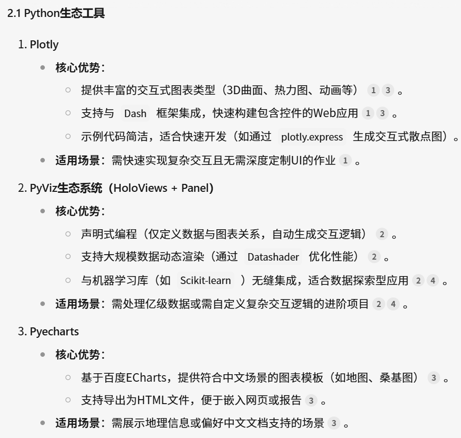
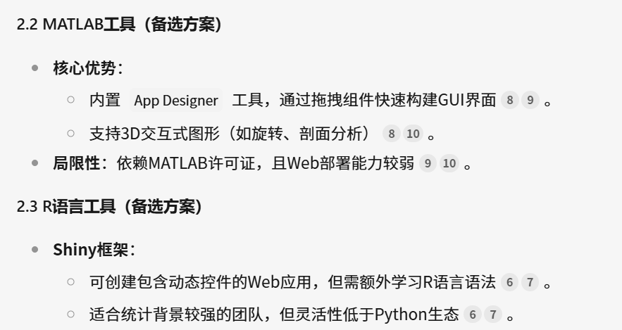
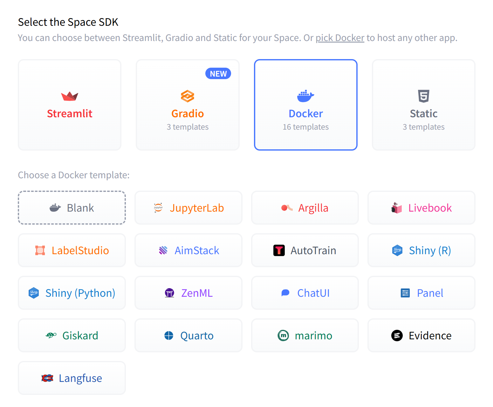
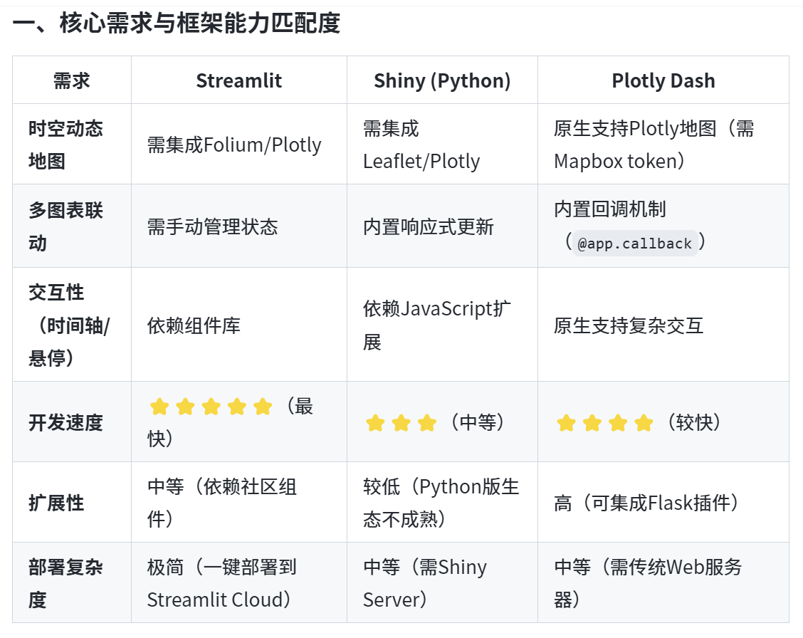
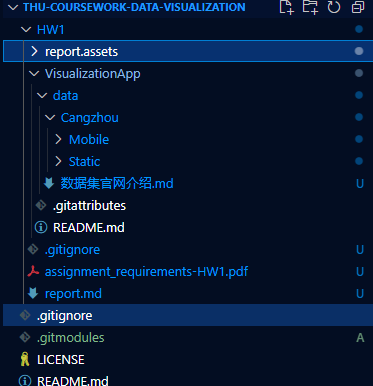

# Visualizing Air Pollution Dataset to gain insights——Data Visualization Assignment 1

叶璨铭, ycm24@mails.tsinghua.edu.cn, 

> In this assignment, you will apply the learned techniques to visualize data. Specifically, you will use the dataset provided below to plot **3** different types of charts.

## 题目背景与数据准备

根据老师的介绍，我们这次可视化的S&M-HSTPM2d5是个开源数据集，通过有效地利用这种数据集里面的信息，可以做到很多。这里有几个背景问题我想搞明白：

- PM2.5的物理意义与健康影响？为什么对环境污染来说比较重要？数据集中PM2.5含量的单位是什么？
- PM2.5数据集是怎么通过可视化来提供科学洞察的？
- zenodo是什么？
- Foshan, Cangzhou, and Tianjin在哪里？
- S&M-HSTPM2d5的设计思路是什么？

经过查询，这几个问题的答案如下

1. PM2.5
   根据AI搜索到的信息, 如[科普文章](https://mp.weixin.qq.com/s?__biz=MzI0NjM4MDQ3MQ==&mid=2247643240&idx=7&sn=37cbf5d6ff15d2c2cf7690b3a9b2587a&chksm=e87f455ded881fc4955f3721ca000f8690d90082ab53624969fca829b43b7a1c364f3836a23d#rd)，PM2.5（空气动力学直径≤2.5微米的颗粒物）是空气污染的核心指标之一。其粒径仅为人类头发丝的1/20至1/30，能够穿透人体呼吸系统屏障，直接进入肺泡甚至血液循环。其表面吸附的重金属（如铅、汞）、多环芳烃（致癌物）和病原微生物等有毒物质，会导致呼吸系统疾病（如哮喘、慢性支气管炎）、心血管疾病（如动脉硬化、心肌梗死）及免疫系统损伤。

​	所以这就是PM2.5为什么会危害健康，被认为是Air Pollusion的一部分。那么PM2.5数据集是怎么检测的呢？根据[博客文章](https://www.163.com/dy/article/JFDOF8AV055663N5.html)，具体检测的方式有光散射法、β射线法等，具体我们就不了解了。

​	参考[博客文章](https://cloud.tencent.com/developer/article/2386438?from=15425)，在科学研究和环境监测中，PM2.5的浓度统一以 **微克每立方米（µg/m³）** 为单位。

2. PM2.5可视化。PM2.5有时空分布和污染模式，所以可以在时间上揭示PM2.5浓度的日变化、季节性和年际趋势；也可以在空间上结合热力图、散点图可展示区域污染差异，高污染暴露区域可以及时指导医疗资源分配。

   AI搜索到了一个[学位论文](https://cdmd.cnki.com.cn/Article/CDMD-10710-1023420587.htm), 通过WebGIS平台发现PM2.5与交通拥堵、能源结构高度相关，这种多维度关联分析可以看到污染的成因。

3. zenodo

   Zenodo是由欧洲核子研究中心（CERN）运营的多学科开放知识库，旨在长期保存和共享科学研究成果。其核心功能包括：

   - **数据存储与DOI分配**：支持上传数据集、代码、论文等各类文件（单文件≤50GB），并为每项资源分配唯一数字对象标识符（DOI），确保可追溯和引用。
   - **协作与版本控制**：支持多版本数据管理，并与GitHub集成，实现代码与数据的同步更新。
   - **跨学科覆盖**：涵盖环境科学（如PM2.5数据集）、生物医学（如单细胞测序数据）等领域，用户可免费下载或上传数据

4. **佛山（Foshan）**位于中国广东省中南部， **沧州（Cangzhou）**位于河北省东南部，**天津（Tianjin）**地处华北平原东北部。根据[政府官网](https://www.cangzhou.gov.cn/cangzhou/c100056/202306/b92034f256c34684adcfa617223af1a0.shtml)，这次作业要看的沧州在这个位置，

   

5. 直接打开[数据集zenodo网站](https://zenodo.org/records/4028130#.Y_tUUGRBwuU)，首先就注意到我们的授课老师陈老师是这个研究的第一作者，非常厉害。

   第一段说到采样率，沧州设置为一分钟，在佛山和天津设置为三秒。可能沧州的PM2.5比较特殊吧。可能就是因为时间间隔长，时间分辨率小，所以才是老师作业要求说的“the smallest portion of this dataset”。

   第二第三段告诉我们这个数据集是已经预处理过的，去掉了异常数据。

   第四段告诉了我们格式，每个 CSV 文件包含三种类型的数据：时间戳（中国标准时间 GMT+8）、地理坐标（纬度和经度）以及 PM2.5 浓度（单位为每立方米微克）。CSV 文件存储在 Static 或 Mobile 文件夹中，这代表了设备的类型。Static 和 Mobile 文件夹存储在相应城市的文件夹中。

## 1.1 选择我的可视化工具

> 1.1. You need to select a programming tool that helps you create the visualization application.

很多同学瞬间就反应过来，那不就是选择我们最熟悉的Python+matplotlib吗？有些同学还会纠结是不是用R语言、MATLAB来画啊。但是这些都不是重点，这次作业不一样，老师的要求里面提到代码部分我们要做的是“VisualizationApp”，既然是App，那就是具有一定的交互性的，而不只是画出来一个图片放到报告里面。所以我们需要寻找具有交互性的可视化画图库，经过和同学讨论，我了解到gradio、streamlit可以做简单交互式前端，还了解到plotly库比matplotlib更有交互性，以及jupyter notebook里面可以显示html，nbdev+quarto可以发布jupyter notebook为交互式的网站。

我们通过大模型搜索一下





大模型也推荐了plotly，和我自己之前了解到的一致，看起来是个比较热门的有人维护的工具。

我们还可以看下huggingface space推荐的可视化库，如果用这些库，我们作业做出来可以部署上去。



我喜欢Python语言，所以首先排除R、MATLAB、js等。而huggingface space上没有plotly或者dash，结合LLM的选择，加之streamlit可以引入plotly作为其绘图能力的一部分，我决定使用streamlit。



现在我们可以初始化一下我们的git版本控制结构


```bash
cd HW1
git submodule add https://huggingface.co/spaces/2catycm/pm2.5-visualization VisualizationApp
```




## 1.2 根据数据绘制三种不同类型的图表

> You need to create 3 different types of graphs based on the given dataset

### (a) A Line Chart that shows how the PM2.5 level changes over time


### (b) A Scatter Plot that shows how vehicles carrying mobile sensors move in the city.

### (c) A 3D Histogram that shows the distribution of PM2.5 levels in the whole city at a specific time range.


## 1.3-1.4 报告要求检查与LLM使用情况声明

