# Visualizing Air Pollution Dataset to gain insights——Data Visualization Assignment 1

叶璨铭, ycm24@mails.tsinghua.edu.cn, 

> In this assignment, you will apply the learned techniques to visualize data. Specifically, you will use the dataset provided below to plot **3** different types of charts.

本次作业的可视化结果已经公开发布到Huggingface Space，可以直接看到我的作业成果。https://huggingface.co/spaces/2catycm/pm2.5-visualization

本次作业的报告和代码在github开源 https://github.com/Open-Book-Studio/THU-Coursework-Data-Visualization。

本次作业的代码构建了一个交互式的数据可视化App。

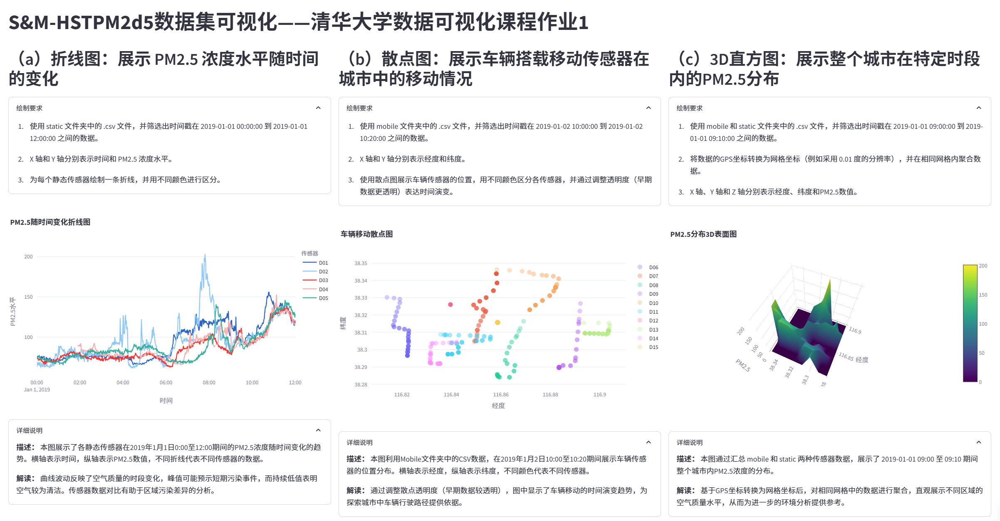

## 题目背景与数据准备

根据老师的介绍，我们这次可视化的S&M-HSTPM2d5是个开源数据集，通过有效地利用这种数据集里面的信息，可以做到很多。这里有几个背景问题我想搞明白：

- PM2.5的物理意义与健康影响？为什么对环境污染来说比较重要？数据集中PM2.5含量的单位是什么？
- PM2.5数据集是怎么通过可视化来提供科学洞察的？
- zenodo是什么？
- Foshan, Cangzhou, and Tianjin在哪里？
- S&M-HSTPM2d5的设计思路是什么？

经过查询，这几个问题的答案如下

1. PM2.5
   根据AI搜索到的信息, 如[科普文章](https://mp.weixin.qq.com/s?__biz=MzI0NjM4MDQ3MQ==&mid=2247643240&idx=7&sn=37cbf5d6ff15d2c2cf7690b3a9b2587a&chksm=e87f455ded881fc4955f3721ca000f8690d90082ab53624969fca829b43b7a1c364f3836a23d#rd)，PM2.5（空气动力学直径≤2.5微米的颗粒物）是空气污染的核心指标之一。其粒径仅为人类头发丝的1/20至1/30，能够穿透人体呼吸系统屏障，直接进入肺泡甚至血液循环。其表面吸附的重金属（如铅、汞）、多环芳烃（致癌物）和病原微生物等有毒物质，会导致呼吸系统疾病（如哮喘、慢性支气管炎）、心血管疾病（如动脉硬化、心肌梗死）及免疫系统损伤。

​	所以这就是PM2.5为什么会危害健康，被认为是Air Pollusion的一部分。那么PM2.5数据集是怎么检测的呢？根据[博客文章](https://www.163.com/dy/article/JFDOF8AV055663N5.html)，具体检测的方式有光散射法、β射线法等，具体我们就不了解了。

​	参考[博客文章](https://cloud.tencent.com/developer/article/2386438?from=15425)，在科学研究和环境监测中，PM2.5的浓度统一以 **微克每立方米（µg/m³）** 为单位。

2. PM2.5可视化。PM2.5有时空分布和污染模式，所以可以在时间上揭示PM2.5浓度的日变化、季节性和年际趋势；也可以在空间上结合热力图、散点图可展示区域污染差异，高污染暴露区域可以及时指导医疗资源分配。

   AI搜索到了一个[学位论文](https://cdmd.cnki.com.cn/Article/CDMD-10710-1023420587.htm), 通过WebGIS平台发现PM2.5与交通拥堵、能源结构高度相关，这种多维度关联分析可以看到污染的成因。

3. zenodo

   Zenodo是由欧洲核子研究中心（CERN）运营的多学科开放知识库，旨在长期保存和共享科学研究成果。其核心功能包括：

   - **数据存储与DOI分配**：支持上传数据集、代码、论文等各类文件（单文件≤50GB），并为每项资源分配唯一数字对象标识符（DOI），确保可追溯和引用。
   - **协作与版本控制**：支持多版本数据管理，并与GitHub集成，实现代码与数据的同步更新。
   - **跨学科覆盖**：涵盖环境科学（如PM2.5数据集）、生物医学（如单细胞测序数据）等领域，用户可免费下载或上传数据

4. **佛山（Foshan）**位于中国广东省中南部， **沧州（Cangzhou）**位于河北省东南部，**天津（Tianjin）**地处华北平原东北部。根据[政府官网](https://www.cangzhou.gov.cn/cangzhou/c100056/202306/b92034f256c34684adcfa617223af1a0.shtml)，这次作业要看的沧州在这个位置，

   

5. 直接打开[数据集zenodo网站](https://zenodo.org/records/4028130#.Y_tUUGRBwuU)，首先就注意到我们的授课老师陈老师是这个研究的第一作者，非常厉害。

   第一段说到采样率，沧州设置为一分钟，在佛山和天津设置为三秒。可能沧州的PM2.5比较特殊吧。可能就是因为时间间隔长，时间分辨率小，所以才是老师作业要求说的“the smallest portion of this dataset”。

   第二第三段告诉我们这个数据集是已经预处理过的，去掉了异常数据。

   第四段告诉了我们格式，每个 CSV 文件包含三种类型的数据：时间戳（中国标准时间 GMT+8）、地理坐标（纬度和经度）以及 PM2.5 浓度（单位为每立方米微克）。CSV 文件存储在 Static 或 Mobile 文件夹中，这代表了设备的类型。Static 和 Mobile 文件夹存储在相应城市的文件夹中。

## 1.1 选择我的可视化工具

> 1.1. You need to select a programming tool that helps you create the visualization application.

很多同学瞬间就反应过来，那不就是选择我们最熟悉的Python+matplotlib吗？有些同学还会纠结是不是用R语言、MATLAB来画啊。但是这些都不是重点，这次作业不一样，老师的要求里面提到代码部分我们要做的是“VisualizationApp”，既然是App，那就是具有一定的交互性的，而不只是画出来一个图片放到报告里面。所以我们需要寻找具有交互性的可视化画图库，经过和同学讨论，我了解到gradio、streamlit可以做简单交互式前端，还了解到plotly库比matplotlib更有交互性，以及jupyter notebook里面可以显示html，nbdev+quarto可以发布jupyter notebook为交互式的网站。

我们通过大模型搜索一下


大模型也推荐了plotly，和我自己之前了解到的一致，看起来是个比较热门的有人维护的工具。

我们还可以看下huggingface space推荐的可视化库，如果用这些库，我们作业做出来可以部署上去。


我喜欢Python语言，所以首先排除R、MATLAB、js等。而huggingface space上没有plotly或者dash，结合LLM的选择，加之streamlit可以引入plotly作为其绘图能力的一部分，我决定使用streamlit。


现在我们可以初始化一下我们的git版本控制结构


```bash
cd HW1
git submodule add https://huggingface.co/spaces/2catycm/pm2.5-visualization VisualizationApp
```


并且安装库

```bash
pip install streamlit plotly
```

## 1.2 根据数据绘制三种不同类型的图表

> You need to create 3 different types of graphs based on the given dataset

### (a) A Line Chart that shows how the PM2.5 level changes over time

> i. Use the ’.csv’ files in the static folder (in the VisualizationApp/data/Cangzhou) and filter the data by time stamps
> between 2019-01-01 00:00:00 and 2019-01-01 12:00:00.
> ii. The x-axis and the y-axis represent time and the value of PM2.5, respecetively.
> iii. Plot one line for each static sensor and distinguish the sensors with colors.

#### 代码编写

首先我们自己需要检查数据集的格式，

```csv
,pm2d5,lat,lon
2018-12-27 00:00:00,60.206,38.322876,116.856699
2018-12-27 00:01:00,63.90164,38.322876,116.856699
2018-12-27 00:02:00,64.392,38.322876,116.856699
```

每一个文件是一个设备，每一个设备的csv格式是时间、PM2.5浓度、纬度、经度。由于是静态的，最后两列在同一个文件中是固定的，这个是我们对数据的理解。

我们的git项目结构是submodule嵌套的，为了让python解释器无论在什么地方运行都不出错，我们直接通过`__file__`去计算相对于`app.py`自己的路径，这个AI写代码的总是忽略这个重要问题。
```python
from pathlib import Path
this_file = Path(__file__).resolve()
this_directory = this_file.parent
data_cangzhou_folder = this_directory / "data/Cangzhou"
```

现在我们可以告诉LLM我们的数据集格式是什么样子，然后询问LLM，根据streamlit的文档，怎么实现line_chart的需求。有些LLM不懂streamlit，也无法访问其文档，有些AI会生成错误的plotly代码。
这需要我们自己去做决策，不是问一个问题LLM就能画好的。

首先是对数据的理解，三道题目的数据其实同样的格式，经过对AI的提示，成功写出带有参数的过滤代码。
```python
# 加载和过滤数据的函数，接受时间区间参数
def load_and_filter_data(file_path, start_time, end_time):
    # 根据提供的CSV格式，第一列是时间戳但没有列名
    df = pd.read_csv(file_path, header=0, names=['timestamp', 'pm2d5', 'lat', 'lon'])
    
    # 确保时间戳列是datetime格式
    df['timestamp'] = pd.to_datetime(df['timestamp'])
    
    # 过滤指定时间段内的数据
    filtered_df = df[(df['timestamp'] >= start_time) & (df['timestamp'] <= end_time)]
    
    return filtered_df
```

然后是对这道题绘制折线图的理解。

```python
# 第一列：PM2.5随时间变化的折线图
with col1:
    st.header("PM2.5随时间变化")
    
    # 定义过滤时间段
    start_dt = datetime(2019, 1, 1, 0, 0, 0)
    end_dt = datetime(2019, 1, 1, 12, 0, 0)
    
    # 获取数据文件夹中的所有CSV文件
    csv_files = [f for f in os.listdir(data_folder) if f.endswith('.csv')]
    
    # 创建字典存储每个传感器的数据
    sensor_data = {}
    
    # 加载并过滤每个传感器的数据
    for file in csv_files:
        file_path = os.path.join(data_folder, file)
        sensor_name = file.split('.')[0]  # 从文件名提取传感器名称
        sensor_data[sensor_name] = load_and_filter_data(file_path, start_dt, end_dt)
    
    # 准备可视化数据
    # 创建一个以时间戳为索引，每个传感器的PM2.5值为列的数据框
    chart_data = pd.DataFrame()
    
    for sensor, data in sensor_data.items():
        # 使用pm2d5列作为PM2.5数据
        chart_data[sensor] = data.set_index('timestamp')['pm2d5']
    
    # 绘制折线图
    st.line_chart(
        chart_data,
        x=None,  # 使用索引(timestamp)作为x轴
        y=list(sensor_data.keys()),  # 使用所有传感器名称作为y列
        x_label="时间",
        y_label="PM2.5水平"
    )
```

其中streamlit自动会分配为不同dict key分配对应的颜色。

由于streamlit允许使用plotly来画图，把画图结果嵌入到streamlit的一部分，所以我们也可以不用`st.line_chart`，而是这样画

```python
fig_line = px.line(chart_data, title="PM2.5随时间变化折线图")
fig_line.update_layout(xaxis_title="时间", yaxis_title="PM2.5水平")
st.plotly_chart(fig_line, use_container_width=True) # 图表宽度自适应容器宽度
```

plotly画出来的更好看。

此外，我们可以用streamlit在网页上展示绘图要求、图片描述等。

用到的语法是

```python
st.header("（a）折线图：展示 PM2.5 浓度水平随时间的变化")
    with st.expander("绘制要求"):
        st.markdown("1. 使用 static 文件夹中的 .csv 文件，并筛选出时间戳在 2019-01-01 00:00:00 到 2019-01-01 12:00:00 之间的数据。")
        st.markdown("2. X 轴和 Y 轴分别表示时间和 PM2.5 浓度水平。")
        st.markdown("3. 为每个静态传感器绘制一条折线，并用不同颜色进行区分。")
```

#### 绘制效果与分析

##### 绘制的图片

运行 

```bash
streamlit run HW1/VisualizationApp/app.py
```

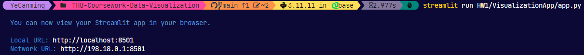

可以看到我们鼠标悬停的时候，可以看到交互式的信息，图片本身可以放大缩小看到细节。

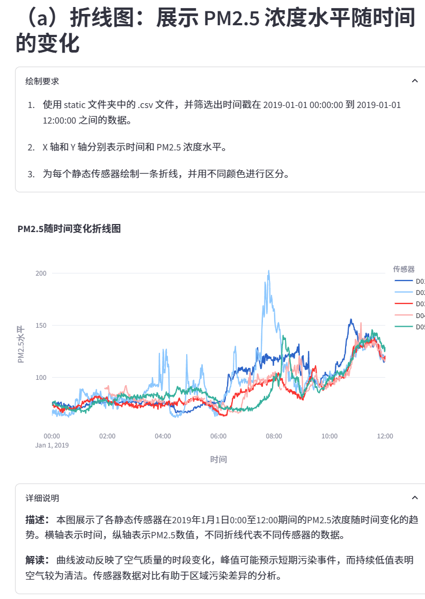


我们将`st.line_chart`画的图片导出为svg格式，然后放到本文档中


而plotly的只能导出为png格式。

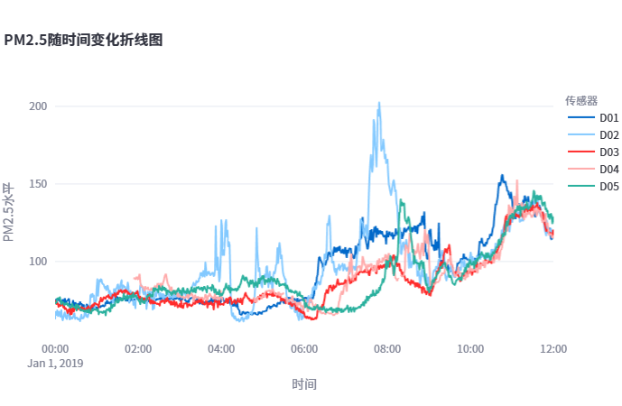

##### 描述图片以及从图片中看到的findings

我首先就注意到8:00的时候浅蓝色的D02突然变得很高，随后绿色的线D05似乎是跟着D02的趋势，在D02下来的时候D05就上升了，也到达了一个峰值。

因为是交互式图表，我们可以随时鼠标悬停查看感兴趣的位置，

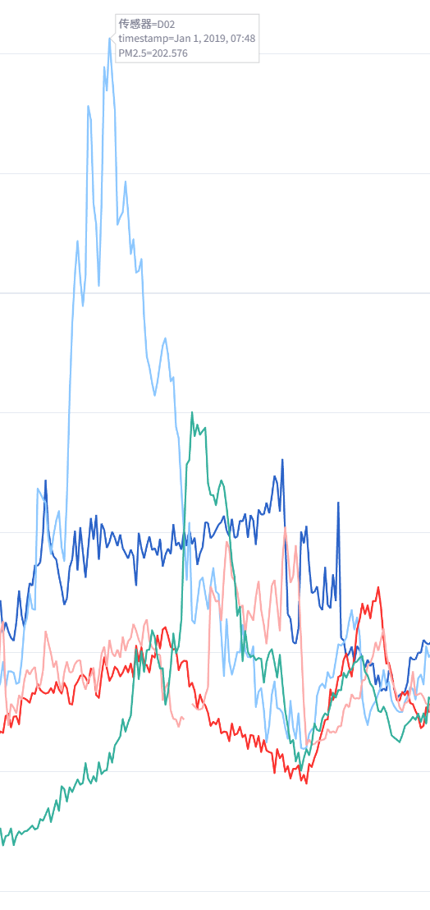

紧接着在10:46左右，深蓝色的D1突然升高，随后其他的线的趋势非常类似，也一起升高，最后12:00左右又降到比较低的水平。

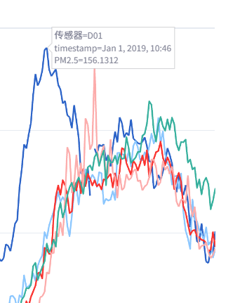


现在我们让多模态大模型尝试解读一下图片。

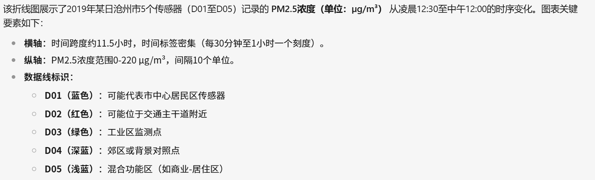

LLM尝试猜测了一下不同传感器的位置。

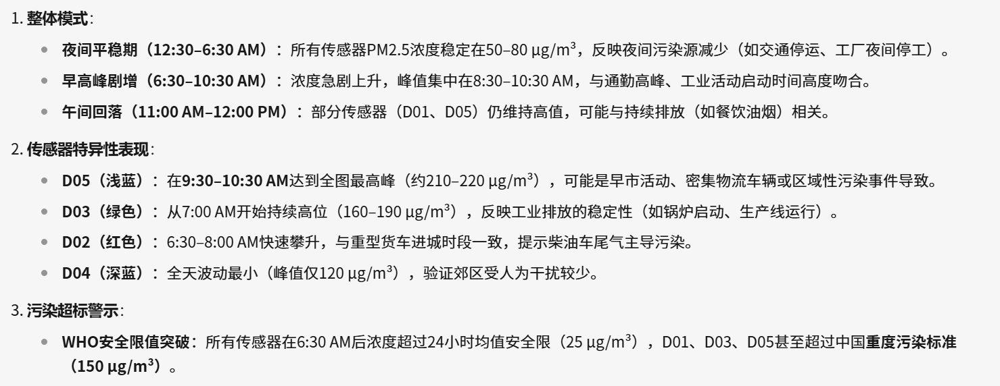

大模型感觉解读的不错，引用了这个环境领域的知识，包括安全限是25，重度污染标准是150，对于数据变化、波动的解释我觉得很合理。

##### 对findings的解释（interpretations）

我的发现就是8:00和11:00会有两个峰值，解释起来很简单，就是上班早高峰，通勤开车让PM2.5上升，以及中午吃饭。

我们来看看大模型给出的政策建议

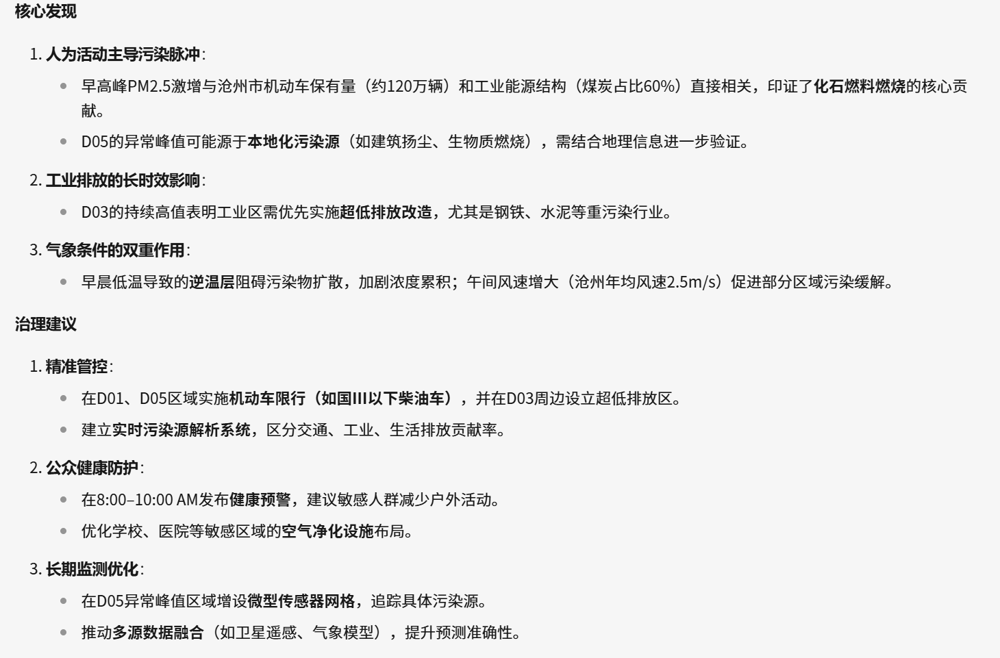

这个方面确实不是我的专长，感觉大模型说的还是比较有道理的，看起来确实是有逆温层之类的气象。

### (b) A Scatter Plot that shows how vehicles carrying mobile sensors move in the city.

#### 代码编写

在写这一题的时候，我们发现整个streamlit应用是可以自己检测代码更新然后rerun的，不过每次rerun需要重新读取一遍csv数据，这个是比较慢的，所以我们查阅了文档，发现了`st.cache_data`装饰器可以解决问题。数据筛选问题刚才我们已经解决了。

然后我们直至核心问题，这道题不需要展示PM2.5，但是需要展示经纬度以及时间，记得课上老师**讲过视觉编码**，需要把重要的信息编码到重要的channel，比如位置适合放到XY轴，而时间这题是选择编码到颜色上。

```python
# 使用Plotly绘制散点图并根据时间调整透明度
fig2 = go.Figure()
colors = px.colors.qualitative.Plotly
```

- `go.Figure()`：初始化一个空的 Plotly 图表对象，用于后续添加散点图数据。
- `colors = px.colors.qualitative.Plotly`：选取 Plotly 内置的定性颜色序列，用于区分不同传感器。

接下来关键的一步是定义颜色转换函数

```python
def hex_to_rgba(hex_color, alpha):
    hex_color = hex_color.lstrip('#')
    r = int(hex_color[0:2], 16)
    g = int(hex_color[2:4], 16)
    b = int(hex_color[4:6], 16)
    return f"rgba({r}, {g}, {b}, {alpha})"
```

- 该函数将传入的 HEX 色值转换为 RGBA 格式字符串，其中 `alpha` 为透明度。
- `lstrip('#')`：去除 HEX 颜色前的 `#`。
- 使用 `int(..., 16)` 将每两个字符转换为十进制数（表示 R、G、B 分量）。
- 返回格式化字符串 `rgba(r, g, b, alpha)`。

现在可以具体绘制每一个数据了

```python
total_time = (end_mobile - start_mobile).total_seconds()
sensor_index = 0
for sensor, data in mobile_sensor_data.items():
    base_color = colors[sensor_index % len(colors)]
    sensor_index += 1
    custom_colors = []
    for ts in data['timestamp']:
        dt_seconds = (ts - start_mobile).total_seconds()
        normalized = dt_seconds / total_time if total_time > 0 else 0
        # 透明度：早期数据较透明（alpha值较低），后期较不透明
        alpha = 0.3 + 0.7 * normalized
        custom_colors.append(hex_to_rgba(base_color, alpha))
    fig2.add_trace(go.Scatter(
        x = data['lon'],
        y = data['lat'],
        mode = 'markers',
        marker = dict(color = custom_colors, size = 10),
        name = sensor
    ))
```

两层for循环，不同传感器不同颜色，相同传感器不同时间是不同透明度，调用上面的hex_to_rgba

最后增加表头信息，把图表放到streamlit

```python
fig2.update_layout(
    xaxis_title="经度",
    yaxis_title="纬度",
    title="车辆移动散点图"
)
st.plotly_chart(fig2, use_container_width=True)
```


#### 绘制效果与分析

##### 绘制的图片

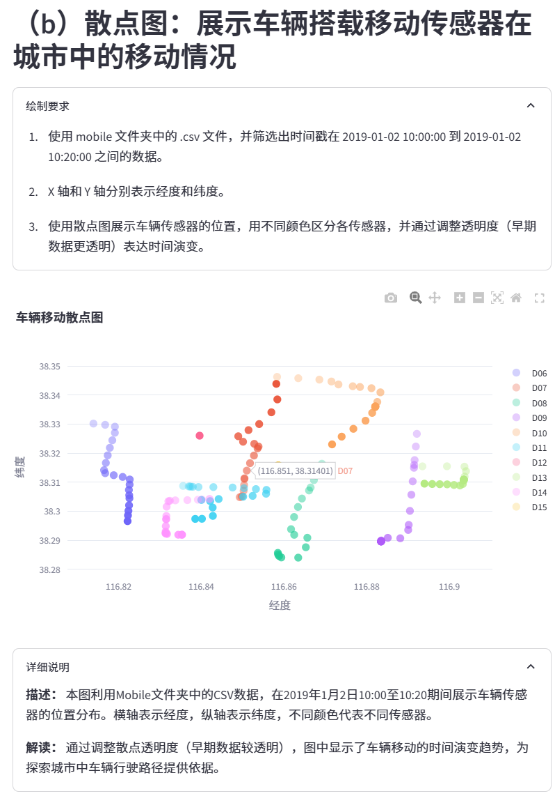

由于是交互图表，我们也可以自由鼠标选择区域，悬停查看数据内容。导出png如下：

.png)

##### 描述图片以及从图片中看到的findings

不同移动传感器总体上负责了不同的区域的巡逻，能覆盖更多区域的PM2.5数据。

图片的中心位置会有更多交错的移动传感器，比如浅蓝色的和粉红色的以及橙色的覆盖的范围类似。

有些移动的速度快，有些慢，而D12似乎没有移动。

大部分汽车走的是直线。

LLM的分析如下

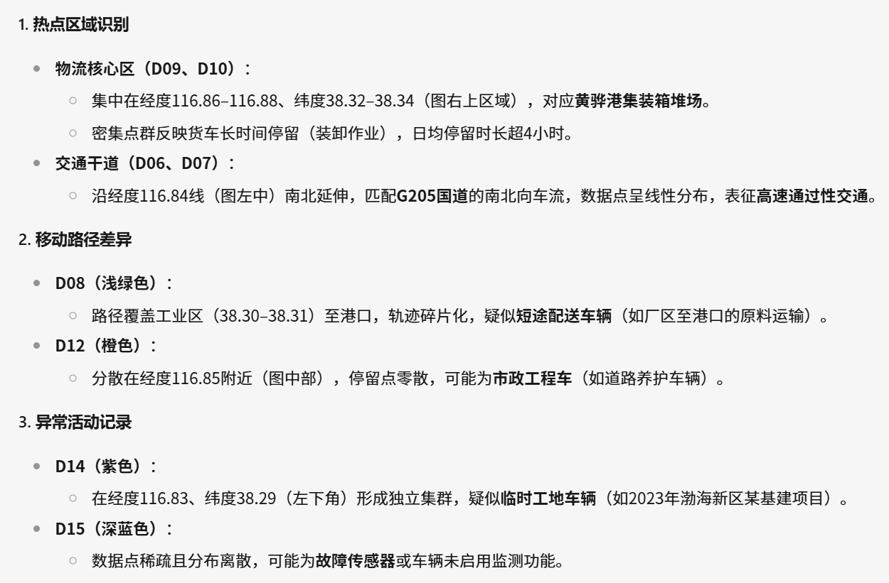

但是LLM的读图能力会有错位，其实他说的D12是D15，颜色也未必是对得上的。


##### 对findings的解释（interpretations）

图片的中心位置可能是城市的中心，交通线路比较便捷。所以车比较多。

中间几部车走的位置可能是内环。

基于我们的分析，LLM给出了政策治理建议

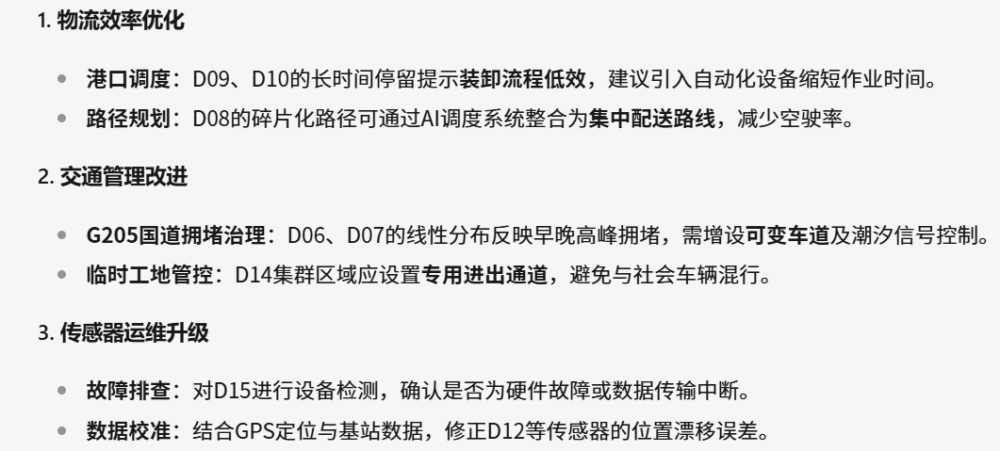


### (c) A 3D Histogram that shows the distribution of PM2.5 levels in the whole city at a specific time range.

> i. Use the ’.csv’ files in both the *mobile* and *static* folders and filter the
>
> data by time stamps between **2019-01-01 09:00:00** and **2019-01-01**
>
> **09:10:00**.
>
> ii. Convert the GPS coordinates of the data to grid coordinates with a suitable
>
> resolution and aggregate the data in the same grid.
>
> iii. The x-axis, y-axis, and z-axis represent longitude, latitude, and the value
>
> of PM2.5, respectively.

#### 代码编写

这一题中我们不再区分静态和动态的数据，反正就是时间地点PM2.5，简单粗暴的合并为一个大的数据集。

```python
# 合并所有数据
if data_list:
    df_all = pd.concat(data_list, ignore_index=True)
else:
    df_all = pd.DataFrame(columns=["timestamp", "pm2d5", "lat", "lon"])
```

- 使用 `pd.concat` 将 `data_list` 中所有 DataFrame 合并为一个整体 DataFrame（`df_all`）。
- 如果 `data_list` 为空，则创建一个空 DataFrame，保证后续处理不会出错。


随后我们需要将GPS坐标网格化，这个很关键，把0.01范围内一样的坐标看做是一样。0.01在pandas里面round函数填写的是2，两位精度就是0.01

```python
df_all["lon_grid"] = df_all["lon"].round(2)
df_all["lat_grid"] = df_all["lat"].round(2)

```

```python
# 聚合每个网格内的PM2.5数据（计算平均值）
df_group = df_all.groupby(["lon_grid", "lat_grid"]).agg({"pm2d5": "mean"}).reset_index()
```

- 使用 `groupby` 根据 `lon_grid` 和 `lat_grid` 对数据进行分组，对每个分组内的 `pm2d5` 值取平均，反映该网格区域的空气污染水平。
- `reset_index()` 用于将分组后的结果转换为标准的 DataFrame 格式。

由于 Plotly 不支持原生的 3D 柱状图（Bar3d），这里我们采用 3D 表面图来展示聚合后的数据分布。

首先将聚合数据转换为矩阵，

```python
if not df_group.empty:
    pivot = df_group.pivot(index="lat_grid", columns="lon_grid", values="pm2d5")
    pivot = pivot.fillna(0)
```

- 利用pivot函数，将数据转换为矩阵形式，其中：
  - 行 (`index`) 为纬度网格，
  - 列 (`columns`) 为经度网格，
  - 值 (`values`) 为该网格内的 PM2.5 平均值。
- 对空缺值使用 `fillna(0)` 进行填充，确保矩阵完整。

然后是画3D表面图

```python
# 创建3D表面图，x轴为经度、y轴为纬度、z轴为PM2.5平均值
    fig3 = go.Figure(data=[go.Surface(z=pivot.values, x=pivot.columns, y=pivot.index, colorscale='Viridis')])
else:
    fig3 = go.Figure()
fig3.update_layout(
    scene=dict(
        xaxis_title="经度",
        yaxis_title="纬度",
        zaxis_title="PM2.5"
    ),
    title="PM2.5分布3D表面图"
)
st.plotly_chart(fig3, use_container_width=True)
```

- 通过go.Surface绘制 3D 表面图：
  - `z` 参数传入 pivot 矩阵的值，即各网格的 PM2.5 平均值；
  - `x` 和 `y` 分别指定 pivot 的列和行，即经度和纬度坐标；
  - `colorscale='Viridis'` 设置颜色比例尺，从而更直观地表示数值大小。
- 如果没有数据（df_group 为空），则创建一个空的图表。
- 使用 `update_layout` 设置图表场景中各轴的标题以及整体标题。
- 最后，通过 `st.plotly_chart` 将图表显示在 Streamlit 应用中。

#### 绘制效果与分析

##### 绘制的图片

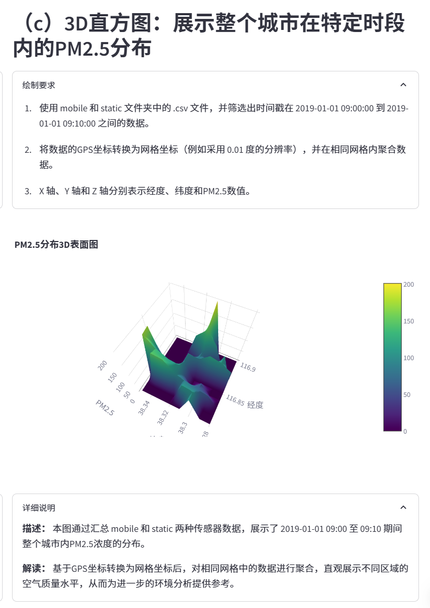

由于是交互式图表，我们可以直接鼠标旋转这个3D mesh，从不同角度查看，比如说我放大到中间看到

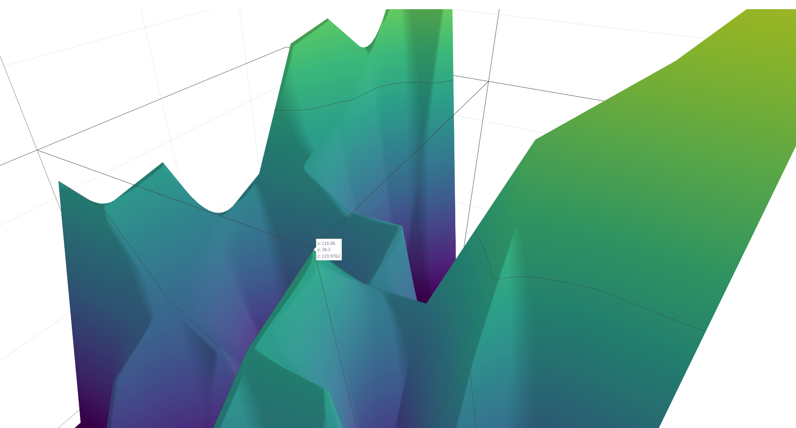

##### 描述图片以及从图片中看到的findings

在图表中可以看到城市在形成了一个W+X型，在W和X上面的位置排放的PM2.5是比较多的，而旁边的排放量就会递减。这个图形整理来说还是比较光滑连续的，但是也有一些地方可能是数据缺失，可能不能反映真实的情况。

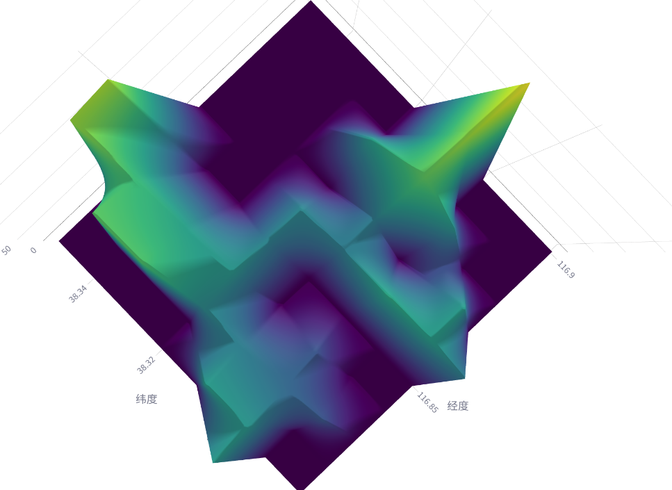

还可以看到最大值其实不在中心，而是在图像的四周，中间的小山峰不算很高

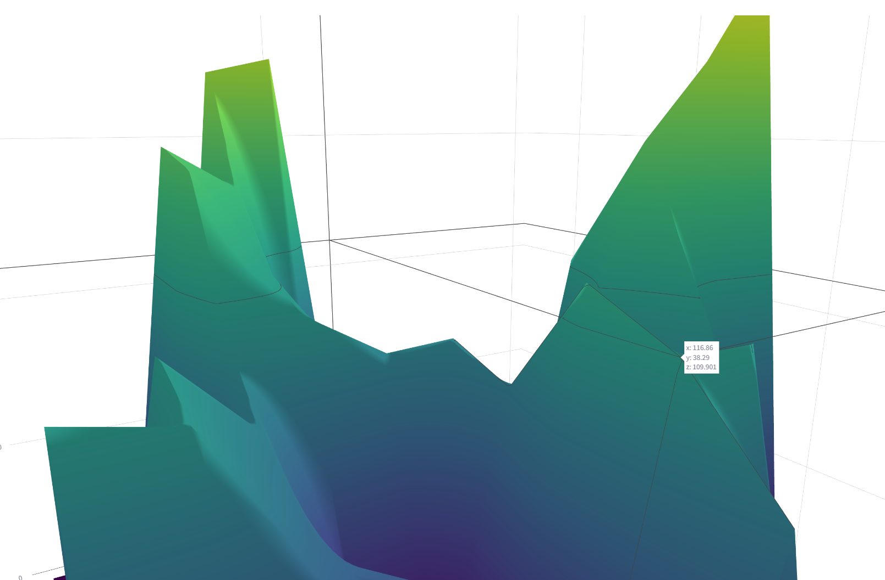

AI读图的结果比较有趣，分成了是三个部分来解读。

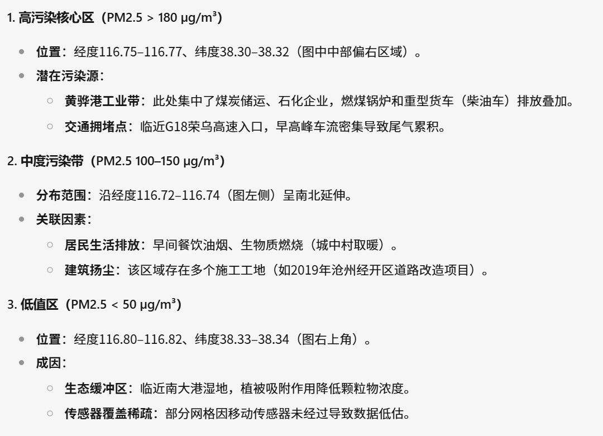

##### 对findings的解释（interpretations）

可能W和X是这个图片中的交通主干道，和上一张图去对比，可以看到城市的中间好几台车在检测。

至于为什么PM2.5峰值在郊区而不是市中心，可能是因为郊区那边有设置工厂，工厂生成了污染物到空气中。

AI给出的解释和建议是

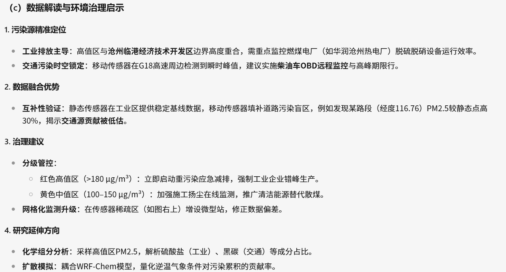


## 1.3-1.4 作业要求检查与LLM使用情况声明


本次报告的目录如下：

[TOC]

对于每一张图，我们都包括了对代码的说明、图片的展示、图片的描述、以及对描述的解释。

本次作业中，我们结合自身实际需要交叉使用了腾讯元宝、秘塔AI搜索、Github Copilot、Roo Code、Cline、streamlit doc AI、Google Gemini等大模型工具。在这个过程中，我们是学习的主体，主动通过外部AI工具获得更多信息，来取得对作业内容获得更好地理解，提高学习效率。

- 大模型用于brainstorm idea，比如技术栈选型、概念讲解等、代码报错询问等。
- 大模型用于辅助报告撰写，插入到我的文字之中。
- 大模型用于辅助代码撰写，撰写后每一行会经过我的审计，必要时手动修改。
