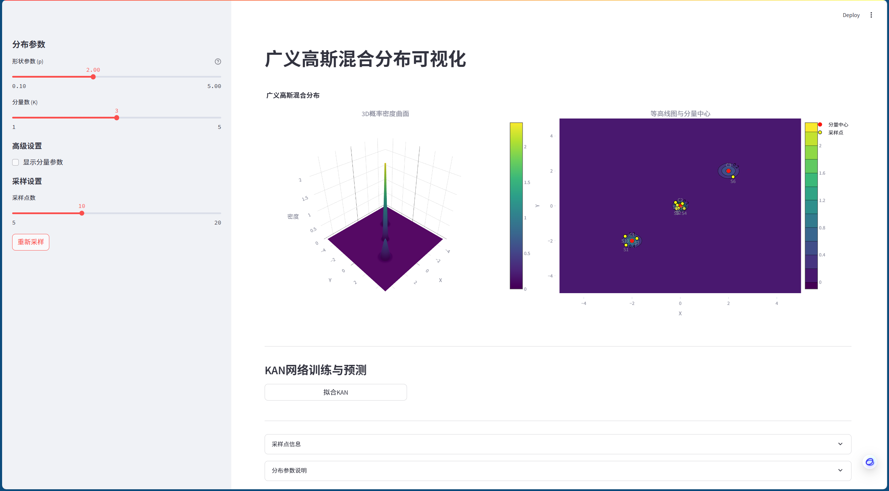
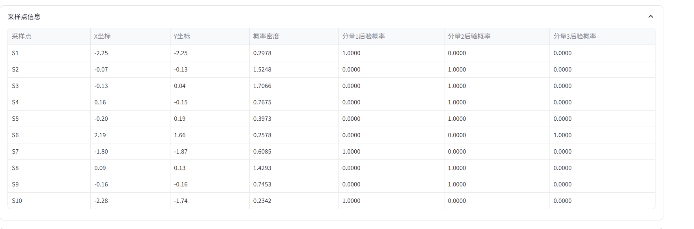
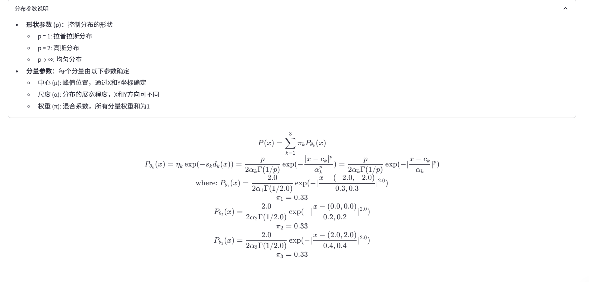
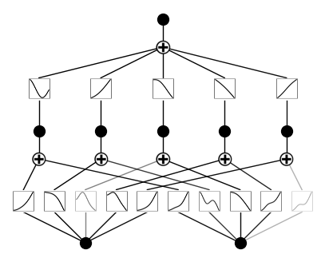
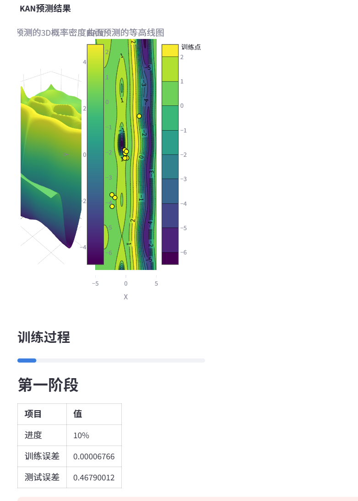

# 基于KAN（Kolmogorov-Arnold Network）模型的广义高斯混合分布参数估计可视化——清华大学数据可视化课程作业2
# Visualization of generalized Gaussian mixture distribution parameter estimation based on KAN (Kolmogorov-Arnold Network) model: Tsinghua University Data Visualization course assignment 2

叶璨铭，2024214500，ycm24@mails.tsinghua.edu.cn

>  在本次作业中，您将有机会应用所学技术，创建一个关于您感兴趣主题的可视化图表。

本次作业的报告和代码在github开源 https://github.com/Open-Book-Studio/THU-Coursework-Data-Visualization。您可以在线阅读本作业的最新版本 https://github.com/Open-Book-Studio/THU-Coursework-Data-Visualization/blob/main/HW2/report.md。


本次作业的代码构建了一个交互式的数据可视化App，这一可视化App已经公开发布到 Hugging Face Space，可以直接通过浏览器在线查看我的作业成果并且进行交互。https://huggingface.co/spaces/2catycm/VisualizationForGeneralizedGaussianMixture 

> 您应准备一张**单页幻灯片**以配合您的展示。此幻灯片应包括您创建的图表以及您希望突出的其他关键信息。

这一网页本身构成了一张交互式的单页幻灯片，可以用于配合我的演示，必要时可以转换为PPT格式。

>  您需要撰写一份**报告**，描述并解释您的图表。

本报告剩余部分的目录如下：

[TOC]

## 主题的选择以及选择的原因

> 要开始本次可视化作业，您需要首先选择一个主题。该主题可以与您的当前研究工作、个人兴趣或您关心的新闻文章相关。如果您难以找到主题，我们提供了两个额外的数据集供您选择。请参阅“附加提供的数据集”部分以获取更多信息。


我们选择对广义高斯混合分布参数估计的过程以及结果进行可视化，其中估计使用的模型是KAN（Kolmogorov-Arnold Network）模型。

KAN是近期机器学习领域最具突破性的架构之一，由MIT、加州理工等顶尖团队提出。其核心创新在于将可学习的激活函数从神经元转移到权重边，并基于Kolmogorov-Arnold定理（多元连续函数可分解为一元函数叠加）构建网络。这一设计在多个科学任务中展现出显著优势：

- 参数效率：以约200参数达到传统MLP（约30万参数）的精度，尤其在小数据集场景下表现突出。

- 可解释性：通过样条函数参数化和激活函数可视化，可直接解释模型学习到的数学关系。例如，KAN能自动发现纽结理论中的数学定律，甚至复现DeepMind的复杂实验结果。

- 科学应用潜力：已在物理相变（如Anderson局域化）、符号公式提取等任务中验证其有效性。

当前学界对KAN的关注度极高（如GitHub星标7.6k、论文热度超5000赞），其创新性设计可能重塑深度学习范式。从2024年5月刚刚提出，到现在（2025年3月28日）已经收获了959引用量。

网络上对于KAN的讨论很多，比如知乎帖子 https://www.zhihu.com/question/1925527001?write 中对KAN的褒贬不一，批评者可能认为KAN的实际效果和其新闻宣传的力度失真，其实有些能力言过其实。但是不可否认的是KAN其本身确实具有一定的研究价值，在一些数据集上确实是比较适用的。

最近我的科研方向 Visual Place Recognition (VPR) 中，我的创新点聚焦于其中局部特征聚合层使用到的Fisher Vector和高斯混合分布​（GMM）。传统地来说，EM算法是最好地估计算法，而在深度学习时代VPR的实际研究的pipeline中，概率分布使用softmax+MLP实现的。我们来试试“网红明星”算法KAN在这个经典的无监督机器学习聚类/概率建模问题上，是否也能有好的表现。

### 与我们数据可视化课程的联系

> 本次作业非常强调“创造力”。因此，建议避免仅使用简单的折线图或散点图。相反，请探索更高级的可视化技术和工具，以一种引人入胜且创新的方式呈现您的数据。在保持清晰和简洁的同时，尽量突破您的创造力边界。

KAN支持将激活函数符号化为数学表达式（如 sin(x) + log(x)），结合树状图或公式流图，可将模型内部逻辑转化为可解释的数学语言,数据可视化课程强调通过视觉隐喻​（如颜色、形状、透明度）传递信息。KAN的可解释性设计（如激活函数可视化）正是这一理念的实践。


## 主题背景知识介绍

### Kolmogorov-Arnold表示定理

在数学中，Kolmogorov-Arnold表示定理（也称为Kolmogorov's superposition theorem）是一个重要的定理，它表明任何连续的多元函数都可以被表示为一系列单变量连续函数的有限组合。具体来说，对于定义在有界域上的任意连续函数 $f : [0,1]^n \to \mathbb{R}$，存在如下表示：

$$f(x) = f(x_1,...,x_n)=\sum_{q=1}^{2n+1}\Phi_q(\sum_{p=1}^n \phi_{q,p}(x_p))$$

其中 $\phi_{q,p}:[0,1]\to\mathbb{R}$ 和 $\Phi_q:\mathbb{R}\to\mathbb{R}$ 都是连续的单变量函数。这个定理的深刻含义在于，它表明加法是唯一真正的多元运算，因为任何其他多元函数都可以通过单变量函数和加法来表示。

### Kolmogorov-Arnold Networks (KAN)

基于Kolmogorov-Arnold表示定理，我们可以将其表示写成矩阵形式：

$$f(x)={\bf \Phi}_{\rm out}\circ{\bf \Phi}_{\rm in}\circ {\bf x}$$

其中：

$${\bf \Phi}_{\rm in}= \begin{pmatrix} \phi_{1,1}(\cdot) & \cdots & \phi_{1,n}(\cdot) \\ \vdots & & \vdots \\ \phi_{2n+1,1}(\cdot) & \cdots & \phi_{2n+1,n}(\cdot) \end{pmatrix},\quad {\bf \Phi}_{\rm out}=\begin{pmatrix} \Phi_1(\cdot) & \cdots & \Phi_{2n+1}(\cdot)\end{pmatrix}$$

Kolmogorov-Arnold Networks (KAN) 是一种基于这个定理的神经网络架构。它将这种表示形式推广到任意深度和宽度，每一层都是一个Kolmogorov-Arnold层，形式为：

$${\bf \Phi}= \begin{pmatrix} \phi_{1,1}(\cdot) & \cdots & \phi_{1,n_{\rm in}}(\cdot) \\ \vdots & & \vdots \\ \phi_{n_{\rm out},1}(\cdot) & \cdots & \phi_{n_{\rm out},n_{\rm in}}(\cdot) \end{pmatrix}$$

整个网络可以表示为：

$${\rm KAN}({\bf x})={\bf \Phi}_{L-1}\circ\cdots \circ{\bf \Phi}_1\circ{\bf \Phi}_0\circ {\bf x}$$

### 广义高斯混合分布（Generalized Gaussian Mixture Model）

为了验证KAN的表达能力和拟合性能，我们选择了广义高斯混合分布(GGMM)作为测试对象。这是一个具有挑战性的密度估计任务，原因如下：

1. **复杂的分布形态**：广义高斯分布通过引入幂次参数p，可以表达多种分布形态：
   - p = 1 时退化为拉普拉斯分布
   - p = 2 时退化为标准高斯分布
   - p → ∞ 时趋近于均匀分布
   - p < 1 时具有更重的尾部

2. **数学表达**：对于第k个分量，其概率密度函数为：

   $$P_{\theta_k}(x_i) = \frac{p}{2\alpha_k \Gamma(1/p)}\exp(-\frac{|x_i-c_k|^p}{\alpha_k^p})$$

   其中：
   - $c_k$ 是中心位置参数
   - $\alpha_k$ 是尺度参数
   - p 是形状参数（幂次）
   - $\Gamma(·)$ 是伽马函数

   由于广义高斯分布是一种“指数家族分布”，可以写成这样的形式
   $$
   P_{\theta_k}(x_i) = \eta_k \exp(-s_k d_k(x_i))
   $$
   **其中第一项$\eta_k$是为了概率归一化，为了让概率分布积分为1而已。**

   **$d_k$ 是一个距离度量，加上exp后相当于得到了一个RBF函数，是一个正定核函数。**$s_k$则是尺度控制。

3. **混合模型的挑战**：通过混合多个广义高斯分布，可以得到更复杂的分布形态：

   $$P(x) = \sum_{k=1}^K \pi_k P_{\theta_k}(x)$$

   其中 $\pi_k$ 是混合权重，满足 $\sum_{k=1}^K \pi_k = 1$。

4. **验证KAN的优势**：
   - 多峰性：混合模型形成的多峰分布对网络的局部适应能力提出了挑战
   - 非线性：广义高斯分布中的幂次项引入了强非线性，测试网络的非线性表达能力
   - 平滑性：分布函数具有良好的平滑性，适合评估网络的泛化能力

## 数据集构造

广义高斯混合分布（GGMM）能够灵活描述多模态、非对称数据分布，由于GGMM似乎没有现成数据集，但是生成又相对容易一些，我们首先编写代码生成数据集。

```python
import numpy as np
from pathlib import Path
from scipy.special import gamma
from typing import Optional, Tuple, Dict, List, Union
import torch
import os

class GeneralizedGaussianMixture:
    r"""广义高斯混合分布数据集生成器
    P_{\theta_k}(x_i) = \eta_k \exp(-s_k d_k(x_i)) = \frac{p}{2\alpha_k \Gamma(1/p)}\exp(-|\frac{x_i-c_k}{\alpha_k}|^p)
    """
    
    def __init__(self, 
                 D: int = 2,           # 维度
                 K: int = 3,           # 聚类数量
                 p: float = 2.0,       # 幂次，p=2为标准高斯分布
                 centers: Optional[np.ndarray] = None,  # 聚类中心
                 scales: Optional[np.ndarray] = None,   # 尺度参数
                 weights: Optional[np.ndarray] = None,  # 混合权重
                 seed: int = 42):      # 随机种子
        """初始化GMM数据集生成器
        Args:
            D: 数据维度
            K: 聚类数量
            p: 幂次参数，控制分布的形状
            centers: 聚类中心，形状为(K, D)
            scales: 尺度参数，形状为(K, D)
            weights: 混合权重，形状为(K,)
            seed: 随机种子
        """
        self.D = D
        self.K = K
        self.p = p
        self.seed = seed
        np.random.seed(seed)
        
        # 初始化分布参数
        if centers is None:
            self.centers = np.random.randn(K, D) * 2
        else:
            self.centers = centers
            
        if scales is None:
            self.scales = np.random.uniform(0.1, 0.5, size=(K, D))
        else:
            self.scales = scales
            
        if weights is None:
            self.weights = np.random.dirichlet(np.ones(K))
        else:
            self.weights = weights / weights.sum()  # 确保权重和为1
        
    def component_pdf(self, x: np.ndarray, k: int) -> np.ndarray:
        """计算第k个分量的概率密度
        Args:
            x: 输入数据点，形状为(N, D)
            k: 分量索引
        Returns:
            概率密度值，形状为(N,)
        """
        # 计算归一化常数
        norm_const = self.p / (2 * self.scales[k] * gamma(1/self.p))
        
        # 计算|x_i - c_k|^p / α_k^p
        z = np.abs(x - self.centers[k]) / self.scales[k]
        exp_term = np.exp(-np.sum(z**self.p, axis=1))
        
        return np.prod(norm_const) * exp_term
    
    def pdf(self, x: np.ndarray) -> np.ndarray:
        """计算混合分布的概率密度
        Args:
            x: 输入数据点，形状为(N, D)
        Returns:
            概率密度值，形状为(N,)
        """
        density = np.zeros(len(x))
        for k in range(self.K):
            density += self.weights[k] * self.component_pdf(x, k)
        return density
    
    def generate_component_samples(self, n: int, k: int) -> np.ndarray:
        """从第k个分量生成样本
        Args:
            n: 样本数量
            k: 分量索引
        Returns:
            样本点，形状为(n, D)
        """
        # 使用幂指数分布的反变换采样
        u = np.random.uniform(-1, 1, size=(n, self.D))
        r = np.abs(u) ** (1/self.p)
        samples = self.centers[k] + self.scales[k] * np.sign(u) * r
        return samples
    
    def generate_samples(self, N: int) -> Tuple[np.ndarray, np.ndarray]:
        """生成混合分布的样本
        Args:
            N: 总样本数量
        Returns:
            X: 生成的数据点，形状为(N, D)
            y: 对应的概率密度值，形状为(N,)
        """
        # 根据混合权重确定每个分量的样本数量
        n_samples = np.random.multinomial(N, self.weights)
        
        # 从每个分量生成样本
        samples = []
        for k in range(self.K):
            x = self.generate_component_samples(n_samples[k], k)
            samples.append(x)
        
        # 合并并打乱样本
        X = np.vstack(samples)
        idx = np.random.permutation(N)
        X = X[idx]
        
        # 计算概率密度
        y = self.pdf(X)
        
        return X, y
    
    def save_dataset(self, save_dir: Union[str, Path], name: str = 'gmm_dataset') -> None:
        """保存数据集到文件
        Args:
            save_dir: 保存目录
            name: 数据集名称
        """
        save_path = Path(save_dir)
        save_path.mkdir(parents=True, exist_ok=True)
        
        # 生成并保存数据
        X, y = self.generate_samples(N=1000)
        np.savez(str(save_path / f'{name}.npz'),
                 X=X, y=y,
                 centers=self.centers,
                 scales=self.scales,
                 weights=self.weights,
                 D=self.D,
                 K=self.K,
                 p=self.p)
    
    @classmethod
    def load_dataset(cls, file_path: Union[str, Path]) -> "GeneralizedGaussianMixture":
        """从文件加载数据集
        Args:
            file_path: 数据文件路径
        Returns:
            加载的GMM对象
        """
        data = np.load(str(file_path))
        return cls(
            D=int(data['D']),
            K=int(data['K']),
            p=float(data['p']),
            centers=data['centers'],
            scales=data['scales'],
            weights=data['weights']
        )

def test_gmm_dataset():
    """测试GMM数据集生成器"""
    # 创建2D的GMM数据集
    gmm = GeneralizedGaussianMixture(
        D=2, 
        K=3, 
        p=2.0,
        centers=np.array([[-2, -2], [0, 0], [2, 2]]),
        scales=np.array([[0.3, 0.3], [0.2, 0.2], [0.4, 0.4]]),
        weights=np.array([0.3, 0.4, 0.3])
    )
    
    # 生成样本
    X, y = gmm.generate_samples(1000)
    
    # 保存数据集
    gmm.save_dataset('test_data')
    
    # 加载数据集
    loaded_gmm = GeneralizedGaussianMixture.load_dataset('test_data/gmm_dataset.npz')
    
    # 验证保存和加载的参数是否一致
    assert np.allclose(gmm.centers, loaded_gmm.centers)
    assert np.allclose(gmm.scales, loaded_gmm.scales)
    assert np.allclose(gmm.weights, loaded_gmm.weights)
    
    print("GMM数据集测试通过！")

if __name__ == '__main__':
    test_gmm_dataset()
```

这里我们假设不同维度的变量是独立的，没有考虑协方差。这是因为不独立的多元高斯分布有矩阵形式，经典教材就能找到，但是多元广义正态分布的矩阵形式比较复杂，在前沿的数学论文中才能找到。为了避免复杂性本次作业暂时不考虑。

## 图1：不同方法性能对比图

由于实际上不同符号回归方法的配置环境比较复杂，有些方法我还没有成功跑通，因此数据实际上是缺失的。**不过我们数据可视化课程的重点在于数据可视化**，数据的获得过程可能我没跑通，但是**我们可以先假设有一个mock/stub模拟的数据**。

对于不同东西的数值对比，我对于老师课上讲解的这个例子印象深刻：


左边的图使用了bar来对比不同的对象的x轴的属性，一开始左边的图没有**排序**，很难看懂，我们拍照的这个PPT中左图已经排好序了，但是还是让人感觉不太清晰，老师最后说原因在于是X轴是从0开始的，而实际上并**没有必要从0开始**。我们视觉上是为了凸显不同对象的差距，所以画成右图的形式会更好。

我们假设我们有很多个方法，经过训练后得到了RMSE指标；这些方法有不同的类别，比如有些是用演化计算来做符号回归，有些是用物理学方法来做符号回归，有些则是用神经网络。

我们选择用**x轴来表示RMSE的值，y轴表示不同方法**，类似于课堂上的图片。

**颜色可以表示类别**，老师课上说类别不多的时候表示类别比较有效，这里方法类别不多，所以我们也用颜色区分。

方法的速度或者说复杂度也很重要， 所以我们**把参数量大小用圆圈的大小**来表示。为了让大小可以比较，我们避免使用不同的形状来表示别的类别信息。

为了让比较清晰可见，**x轴坐标的最小值最大值是数据的最小值和最大值。**关键的代码如下

```python
# 动态轴范围计算
data_min = (df['RMSE'] - df['Uncertainty']).min()
x_min = max(data_min - 0.05, 0)  # 保证最小值不低于0
x_max = min(df['RMSE'].max() + df['Uncertainty'].max(), 1)  # 保证最大值不超过1
```

数据随机生成。

最后我们绘制的效果如图

.png)


## 图2：Ground Truth分布的可视化



我们构建了标准的热力图，从三维曲面和二维等高线两个角度来可视化高斯混合分布。热力图用颜色来编码概率密度的大小，由于我们图中是连续的，所以还是能看出这个颜色的变化的。

由于我们做的是交互式图表，非常有创造性，你可以在网页动态修改ground truth分布的参数，看到分布的变化。

采样点在图中用黄色表示，红色是中心点。

KAN的拟合是通过黄色的点进行的，只要按下按钮就可以开始拟合。


请打开我们的动态网页来体验详细内容。


此外我们还提供了采样点的概率分布计算



以及分布的公式表示




## 图3：KAN网络随着训练过程可视化变化图

虽然作业只要求最少两张图，我们KAN本身的可视化也很重要。







随着神经网络的训练，KAN的网络结构会动态发生变化，会进行剪枝，请到交互式网页中体验。

同样地，用热力图来表示分布情况。


## LLM使用情况声明

对于每一张图，我们都包括了对代码的说明、图片的展示、图片的描述、以及对描述的解释。

本次作业中，我们结合自身实际需要交叉使用了腾讯元宝、秘塔AI搜索、Github Copilot、Roo Code、Cline、streamlit doc AI、Google Gemini等大模型工具。在这个过程中，我们是学习的主体，主动通过外部AI工具获得更多信息，来取得对作业内容获得更好地理解，提高学习效率。

- 大模型用于brainstorm idea，比如技术栈选型、概念讲解等、代码报错询问等。
- 大模型用于辅助报告撰写，插入到我的文字之中。
- 大模型用于辅助代码撰写，撰写后每一行会经过我的审计，必要时手动修改。


